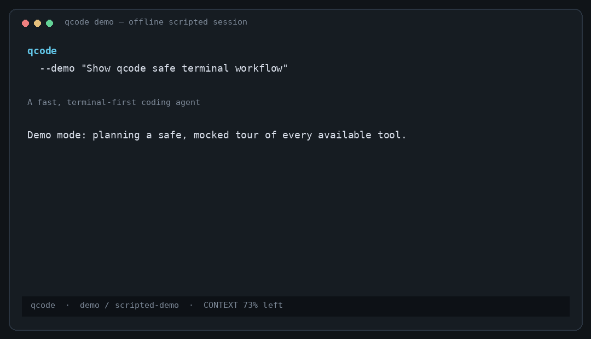

# qcode

[](https://go.dev/)
[](LICENSE)
[]()

> A fast, terminal-first coding agent inspired by Pi

qcode is a lightweight, keyboard-driven AI coding assistant that runs entirely in your terminal. One native executable, streaming LLM output, and a compact provider/tool interface.

## 🎬 Demo



The animation was generated with `qcode --demo`: it shows the same scripted,
offline-safe workflow available locally, without contacting a provider or changing
your workspace.

## ✨ Features

- 🖥️ **Full-viewport TUI** with editable input, per-agent history, and ANSI-colored Markdown
- 🤖 **Multi-agent support** with up to 4 concurrent agent tabs
- 🔧 **Rich toolset** including read, write, edit, list, search, shell, and web tools
- 🧠 **Global learning** that persists preferences across sessions
- 🎯 **Skills system** for workspace-local instruction bundles
- 🔒 **Sandbox mode** for isolated tool execution on Linux
- 📊 **Context tracking** with real-time token usage display

## 🚀 Quick Start

### Installation

```sh
# Build from source (requires Go 1.22+)
make build
./bin/qcode
```

### Usage

```sh
# With Ollama (default)
ollama pull qwen2.5-coder:7b
qcode --model qwen2.5-coder:7b

# With OpenAI
export OPENAI_API_KEY=...
qcode --provider openai --model gpt-5

# Try without configuration
qcode --demo "show me how qcode works"
```

## 📖 Documentation

- [Interface](docs/interface.md) - Terminal UI, slash commands, and navigation
- [Providers](docs/providers.md) - Ollama, OpenAI, and OpenCode Go setup
- [Multi-agent](docs/agents.md) - Concurrent agent tabs and orchestration
- [Skills](docs/skills.md) - Workspace-local instruction bundles
- [Web Tools](docs/web-tools.md) - HTTP fetching and search capabilities
- [Learning](docs/learning.md) - Persistent preferences and procedures
- [Configuration](docs/configuration.md) - Config file locations and options
- [Trust Model](docs/trust-model.md) - Security and sandbox behavior
- [Building](docs/build.md) - Build instructions and release process
- [Extending Providers](docs/extending-providers.md) - Adding new LLM providers

## 🔧 Configuration

qcode loads the first `config.toml` file it finds. Copy [`config.toml.example`](config.toml.example) to one of the supported locations:

```toml
provider = "openai"
base_url = "http://localhost:8000/v1"
api_key = "your-api-key"
model = "my-model"
max_steps = 32
sandbox = true
```

See [Configuration](docs/configuration.md) for lookup locations and precedence rules.

## 🤝 Contributing

Contributions are welcome! Please feel free to submit a Pull Request.

## 📄 License

This project is licensed under the MIT License - see the [LICENSE](LICENSE) file for details.

## 🙏 Acknowledgments

- Inspired by [Pi](https://github.com/earendil-works/pi)
- Built with Go and standard library networking
